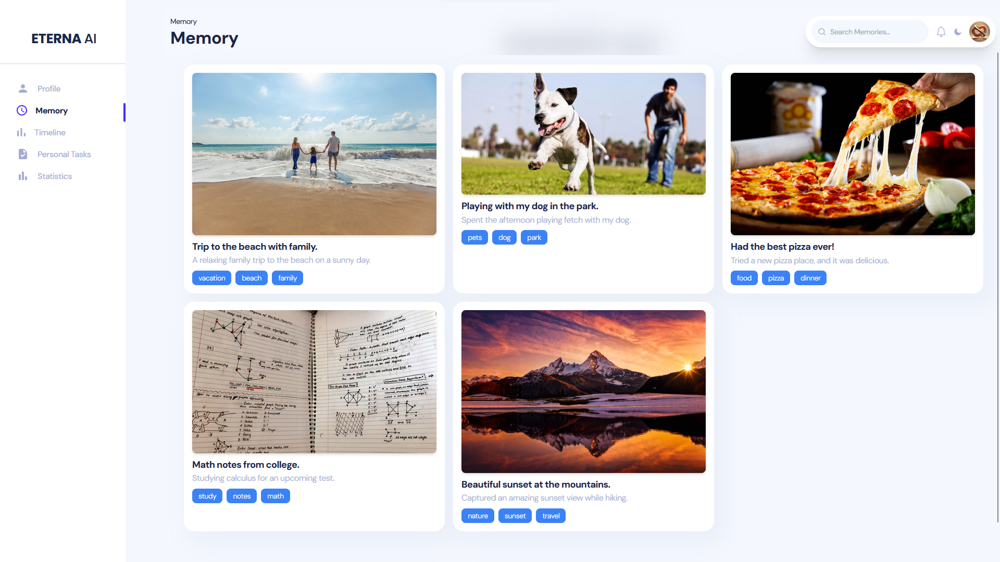
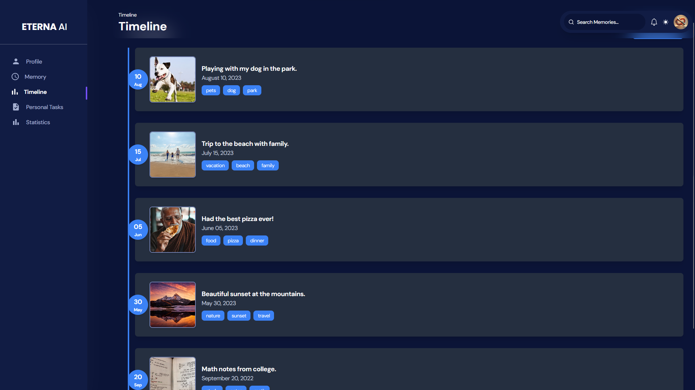

# Eterna - AI-Powered Memory Search


Eterna is an AI-powered memory retrieval system that allows users to **search for past experiences, images, and moments** using natural language queries. The application integrates **Google Gemini AI** for intelligent memory tagging and **offline storage** for customization.

## 🌟 Features

- **AI-Powered Search** – Retrieve images and descriptions based on AI-generated tags.
- **Timeline View** – View your past moments with a clean, structured UI.
- **Image Uploads** – Store and categorize images with automatic AI tagging.
- **Offline Storage** – Dark mode and notification settings saved using `localStorage`.
- **Fast & Responsive UI** – Built with **React + Tailwind CSS** for a smooth user experience.

---

## 📸 Screenshots

### **Personal Tasks**  


### **Usage Statistics**  


### **Image Upload with AI Tagging**  


### **Memory Search**  


### **Timeline**  


---

## 🚀 Getting Started

### 1️⃣ Backend Setup

#### **Step 1: Install Dependencies**
Ensure you have **Python 3.10+** installed, then run:
```sh
cd backend
pip install -r requirements.txt
```

#### **Step 2: Set Up Google Cloud Credentials**
To enable AI-powered search and image processing, you need to set up **Google Cloud**:

1. **Install Google Cloud CLI** (this may take a while):  
   [Download Google Cloud CLI](https://cloud.google.com/sdk/docs/install)

2. **Authenticate with Google Cloud**:
   - Open **Google Cloud SDK Shell** (installed with the CLI)
   - Run:
     ```sh
     gcloud auth application-default login
     ```
   - Log in with a Google account that has Google Cloud CLI enabled.

3. **Enable Required APIs**:
   - Go to the **Google Cloud Console**.
   - Ensure the following APIs are enabled:
     - **Cloud Natural Language API**
     - **Service Usage API**
     - **Cloud Vision API**
   - If they are not enabled, enable them manually from the **Google Cloud API Library**.

4. **Set the Google Cloud Project ID**:
   - Retrieve your **Project ID** from the **Google Cloud Console**.
   - Run:
     ```sh
     gcloud auth application-default set-quota-project [PROJECT_ID]
     ```
     Replace `[PROJECT_ID]` with your actual project ID.

5. **Ensure Billing is Set Up**:
   - You must either **sign up for free credits** (Google offers **$300 USD** in free credits, which should be sufficient).
   - Or **fund your account** manually, as API usage costs around **$0.15 per 1M requests**.

#### **Step 3: Run the Backend Server**
Start the Flask API:
```sh
python app.py
```
The backend will be running at: **`http://127.0.0.1:5000`**

### 2️⃣ Frontend Setup

#### **Step 1: Install Dependencies**
Ensure you have **Node.js 16+** installed, then run:
```sh
cd ..
cd frontend
npm install
```
This installs all required packages from `package.json`.

#### **Step 2: Start the Frontend**
Run the development server:
```sh
npm start
```
The frontend will be live at: **`http://localhost:3000`**

---

## 🛠 Tech Stack
- **Frontend:** React, Tailwind CSS
- **Backend:** Flask, Google Gemini AI, Google Cloud Vision
- **Database:** Local JSON Storage
- **Authentication:** None (Future Support Planned)

---

## 📝 Contributing
Want to improve Eterna? Feel free to fork and submit a PR! 🚀

1. Fork the repository  
2. Create a new branch (`git checkout -b feature-branch`)  
3. Make your changes & commit (`git commit -m 'Added new feature'`)  
4. Push your branch (`git push origin feature-branch`)  
5. Open a pull request  

---

## 🐟 License
Eterna is licensed under the **MIT License** – free to use and modify!

---

## 💡 Acknowledgments
Special thanks to **Google GenAI** for their incredible APIs that power  
Eterna’s intelligence. 🙌
